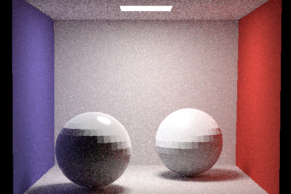
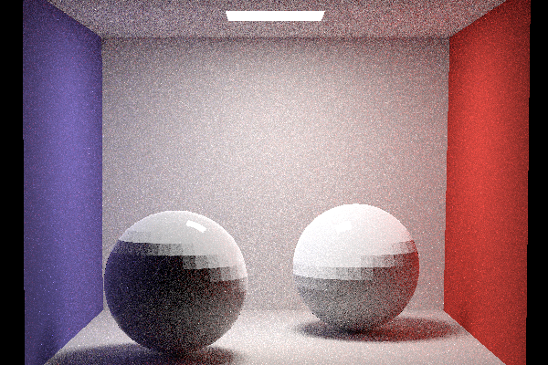
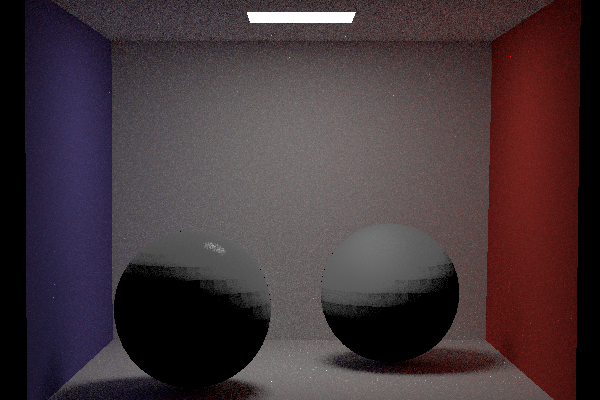
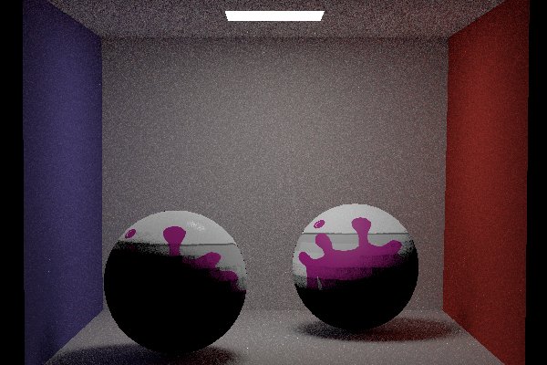
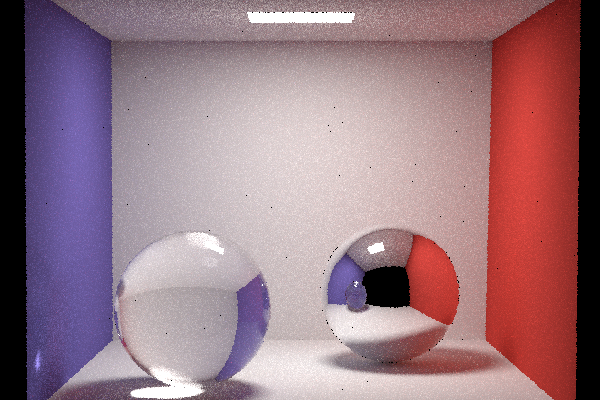
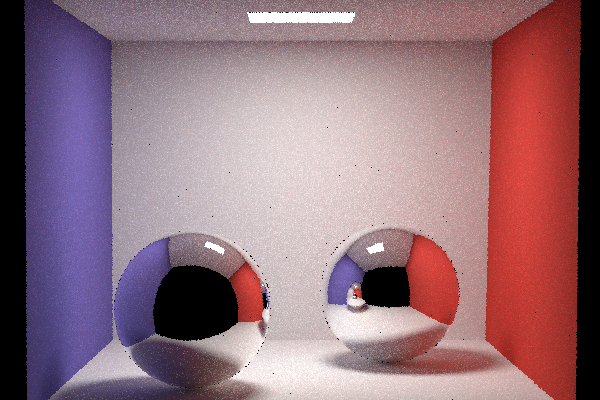
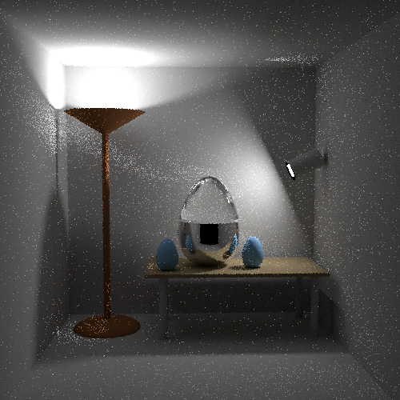

# RayTracer-Nori
This is a basic ray tracer extended by a TU Wien student based on Nori

## About

Nori is a minimalistic ray tracer written in C++. It runs on Windows, Linux, and Mac OS and provides a foundation for the homework assignments in the course Advanced Computer Graphics taught at EPFL.

https://wjakob.github.io/nori/#pa5
# Final Scene

# Materials
- Diffuse
- Mirror
- Dielectric
- Microfacet
- Texture
  - Image Textures
  - Procedural Texture
  
 
 
 

# Integrators
- Path Tracing
- Russian roulette
- Monte Carlo
- Multiple Importance Sampling
  - Balance Heuristic
  - BSDF importance sampling
  - direct light surface sampling
  
 

# Participating Media
